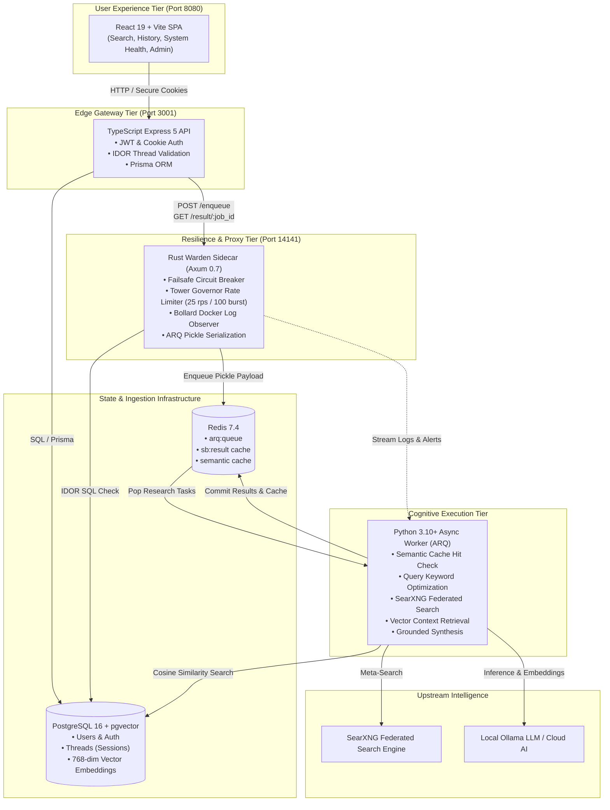

# 🚀 SearchBoost: Autonomous Cognitive Search & Vector Grounding Engine

[](https://opensource.org/licenses/MIT)
[](https://www.rust-lang.org/)
[](https://www.typescriptlang.org/)
[](https://www.python.org/)
[](https://github.com/pgvector/pgvector)
[](https://react.dev/)

**SearchBoost** is a production-grade, distributed cognitive search and vector grounding engine engineered with a resilience-first architecture. It bridges private LLM reasoning with real-time web intelligence and long-term conversational memory while safeguarding infrastructure with a high-throughput **Rust Warden sidecar**.

---

## 🏗️ System Architecture



---

## ⚡ Multi-Tier Topology

| Tier | Component | Technology | Primary Invariants |
| :--- | :--- | :--- | :--- |
| **Frontend** | `searchboost_ui` | React 19, Vite, React Router 7 | Session persistence, real-time circuit health indicator, responsive research dashboard. |
| **API Gateway**| `searchboost_api` | TypeScript 5.4, Express 5, Prisma | Strict JWT authentication, bcrypt (12 rounds), IDOR thread ownership checks, non-root execution. |
| **Reliability**| `searchboost_warden` | Rust 2021, Axum, Tokio, Failsafe, Governor | Zero-allocation HTTP proxy, dynamic Docker log aggregation (`bollard`), failsafe circuit breaking. |
| **Worker** | `searchboost_service` | Python 3.10+, ARQ, AsyncIO, HTTPX | Multi-engine meta-search normalization, vector memory retrieval, grounded LLM synthesis. |
| **Database** | `sb_db` | PostgreSQL 16 + `pgvector` | HNSW cosine similarity search over 768-dimensional conversational turn embeddings. |
| **Cache & Q** | `sb_redis` | Redis 7.4 (Authenticated) | Async task queues (`arq:queue`), intermediate job results, and semantic prompt caching. |

---

## 🛡️ Key Engineering Highlights

### 1. The Warden Authority Pattern (Safe Rust Sidecar)
High-level AI worker pipelines often experience latency spikes or resource starvation. Instead of allowing client traffic to overwhelm the inference worker, all traffic flows through **The Warden**:
- **Failsafe Circuit Breaker**: Evaluates Redis and database error rates in real time. Tripping immediately returns `503 Service Unavailable`, shedding load and protecting the storage engine.
- **GCRA Rate Limiting**: Built with `tower-governor` enforcing a smooth 25 req/sec limit with 100-burst tolerance.
- **Docker Bollard Observer**: Dynamically discovers containers with label `com.searchboost.service=worker` and streams live container logs and alert signatures directly to persistent audit storage.

### 2. Distributed Handshake & Zero-Trust Session Isolation
Cross-user data leakage and IDOR attacks are systematically prevented across all layers:
- **Consistent Session Namespace**: Every job is stamped with a colon-delimited shard identifier:
  $$\text{job\_id} = \text{SB-SESSION}:\{\text{username}\}:\{\text{thread\_id}\}:\{\text{uuid4}\}$$
- **Two-Tier Validation**:
  1. *On Enqueue*: The Warden performs a parameterized SQL query verifying that the thread ID is owned by the authenticated username.
  2. *On Result Retrieval*: The API and Warden assert that the job ID prefix matches the calling user's authenticated identity.

### 3. Long-Term Vector Grounding (`pgvector`)
Every conversation turn is transformed into a 768-dimensional dense vector embedding (via `nomic-embed-text` or Ollama). Prior to research synthesis, SearchBoost performs cosine similarity vector searches against historical context:
```sql
SELECT id, role, prompt, response, 1 - (embedding <=> $1) AS similarity
FROM conversation_turns
WHERE user_id = $2 AND 1 - (embedding <=> $1) > 0.65
ORDER BY similarity DESC
LIMIT 5;
```

### 4. Direct Sister Compatibility with IronWarden
SearchBoost shares an identical session convention and payload contract with **[IronWarden](https://github.com/Somnerd/IronWarden)** (the Sovereign AI Privacy Shield). All privacy filtering, PII scrubbing, synthetic tokenization, and cryptographic audits are delegated exclusively to IronWarden at ingress, eliminating redundant PII regex checks inside SearchBoost and keeping the cognitive engine lightweight and focused.

---

## 🚀 Quickstart Guide

### Prerequisites
- Docker & Docker Compose
- *Optional (for local development)*: Rust 1.80+, Node.js 20+, Python 3.10+

### 1. Launch the Distributed Stack
```bash
# Clone the repository
git clone git@github.com:Somnerd/SearchBoost.git
cd SearchBoost

# Launch all 8 containers in detached mode
docker-compose up -d --build
```

### 2. Verify Services
- **React Web Dashboard:** [http://localhost:8080](http://localhost:8080)
- **Node.js Express API:** [http://localhost:3001/health](http://localhost:3001/health)
- **Rust Warden Relay:** [http://localhost:14141/health](http://localhost:14141/health)
- **SearXNG Meta-Search:** [http://localhost:8888](http://localhost:8888)

### 3. Query via the Autonomous CLI
```bash
python3 searchboost_service/main.py --query "Latest advancements in autonomous AI agents" --username nikolas
```

---

## 🧪 Comprehensive Automated Test Verification

SearchBoost maintains 100% test pass rates across all language tiers:

### Rust Warden Test Suite (17 Tests)
```bash
cd searchboost_warden
cargo fmt --check
cargo clippy --all-targets -- -D warnings
cargo test --all-targets
```
*Coverage: Circuit breaker failure threshold, half-open cooldown, thread-safe environment configuration overrides, SearchRequest serialization, and IDOR prefix validation.*

### TypeScript Express API Test Suite (22 Tests)
```bash
cd searchboost_api
npm test
```
*Coverage: Health check failover, JWT auth validation, role-based access control (RBAC), self-deletion guards, search enqueuing, and cross-user IDOR rejection.*

### Python Worker & Handshake Test Suite (11 Tests)
```bash
PYTHONPATH=searchboost_service pytest searchboost_tests -v
```
*Coverage: CLI argparser options and interactive fallback, timeout defense, and distributed handshake payload schemas (delegating PII shielding to IronWarden).*

---

## 📄 License & Commercial

This project is open-source under the **[MIT License](LICENSE)**.  
Copyright (c) 2026 Nikolaos Alexandrakis.

For consulting, custom enterprise deployments, or inquiries:  
📧 **nikolasalexandrakis.work@gmail.com**
