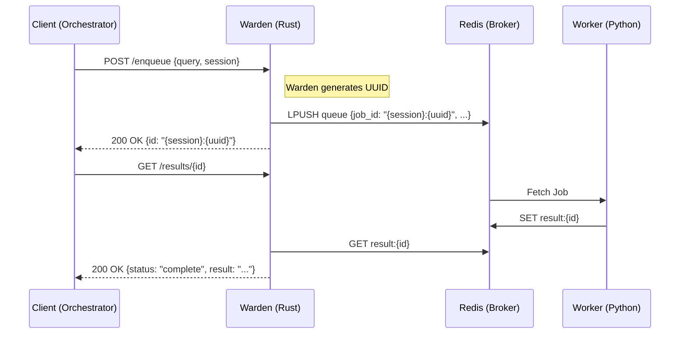

# SearchBoost: System Design & Architecture

## 🛡️ The "Warden Authority" Model

The core architectural shift in SearchBoost is the move from a client-centric model to a **Sidecar Authority** model. The Warden is no longer just a proxy; it is the gatekeeper of the system's identity.

### 1. Job Identity: Composite Keys
To ensure horizontal scalability and observability, we use **Composite Keys**:
`Key = {session_id}:{uuid}`

*   **Session ID**: Derived from the client, used for partitioning and data locality.
*   **UUID**: Randomly generated by the Warden (using `uuid v4`), ensuring global uniqueness.
*   **Enterprise Scaling**: The `{}` brackets act as a **Redis Hash Tag**, ensuring all jobs for a specific session are stored on the same Redis shard, optimizing network performance.

### 2. Decision Logic: Happy Path vs. Fallback

| Logic | Happy Path (Normal) | Fallback (Warden Down) |
| :--- | :--- | :--- |
| **Authority** | Warden (Rust) | Orchestrator (Python) |
| **Communication** | HTTP (Axum) | Direct Redis (Arq) |
| **ID Generation** | Warden via UUID v4 | Arq internal generator |
| **Tracking** | Warden Polling | Direct Arq Polling |

### 3. Configuration Hierarchy
We use a "Pragmatic Professional" configuration system designed for both self-hosted enthusiasts and enterprise containers:

*   **`.env`**: Global environment overrides (e.g., `SEARCHBOOST_WARDEN_PORT`).
*   **`warden.ini`**: Hierarchical configuration for the Rust sidecar (Network, Redis, Observer, Breaker).
*   **`service_settings.json`**: Dynamic overrides for AI strategies and engine URLs.

### 4. Resilience Patterns
*   **Circuit Breaker**: The `failsafe` library in Rust monitors Redis connectivity. If three failures occur, the circuit opens, immediately notifying the client (503) to switch to Fallback mode.
*   **Observer Pattern**: The Warden monitors the Docker socket to ensure the Worker container is alive and generating logs.

## 🌉 Communication Sequence

