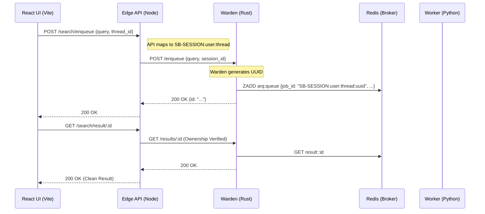

# SearchBoost: System Design & Architecture

## 🛡️ 1. The 4-Tier distributed "Warden Authority" Model

SearchBoost is architected as a high-security distributed research pipeline. It follows a multi-actor "Authority" model where identity, rate-limiting, and execution are strictly isolated across technology stacks.

### Tier 1: User Experience (React + Vite)

The frontend serves as the interaction layer, handling concurrent chat threads and visual state transitions. It communicates strictly with Tier 2 using secure session cookies.

### Tier 2: The Security Boundary (Node.js API)

The Node.js API acts as the **Identity Shield**. 
*   **Session Synthesis**: It transforms standard user sessions into unique **Colon-Delimited Keys**: `SB-SESSION:${username}:${thread_id}`.
*   **Result Isolation**: Every result fetch from Tier 3 is validated against the authenticated user's ID to prevent IDOR traversal.

### Tier 3: The Reliability Engine (Rust Warden)

The Warden is a high-speed Rust proxy that protects the background workers.
*   **Rate Limiting**: Uses a **GCRA algorithm** (`tower_governor`) to throttle requests at the edge (25 req/s).
*   **Circuit Breaker**: Monitors the health of Redis and the background workers. If failures persist, it gaps the incoming traffic to allow the stack to recover.
*   **Authority**: It is the final generator of the unique **Composite Job ID**: `SB-SESSION:user:thread:uuid`.

### Tier 4: The Research Loop (Python Worker)

The Worker executes the intensive LLM and web-search tasks.
*   **Triple-Gate PII Security**: Scans user input, optimizer output, and final synthesis for sensitive data (PII).
*   **Semantic Caching**: Performs TTL-aware caching to skip redundant research for identical intent-patterns.

---

## 🏗️ 2. Configuration & Precedence

SearchBoost uses a hierarchical, secure configuration strategy:
*   **Master YAML**: `master_settings.yml` (Foundation).
*   **Service Overrides**: `warden.yml` and `worker.yml` (Domain-specific tuning).
*   **Secrets Isolation**: Mandatory `.env` file with `chmod 600` permissions.

### Priority Path:

`CLI Flags > Environment Variables > YAML Files > System Defaults`.

---

## 🌉 3. Communication Architecture

---

## 🛠️ 4. Security Philosophy: Fail-Closed

The system is designed to "Fail-Closed" rather than "Fail-Open."
1.  **Missing Secrets**: If `JWT_SECRET` is undefined, the API will crash on boot rather than using a default.
2.  **Unprivileged Execution**: 100% of the production stack runs as non-root users (`node`, `python-slim`, `nginx-unprivileged`).
3.  **Delimiter Integrity**: All internal identifiers use strict colons (`:`) as delimiters to prevent string-prefix collision attacks.
